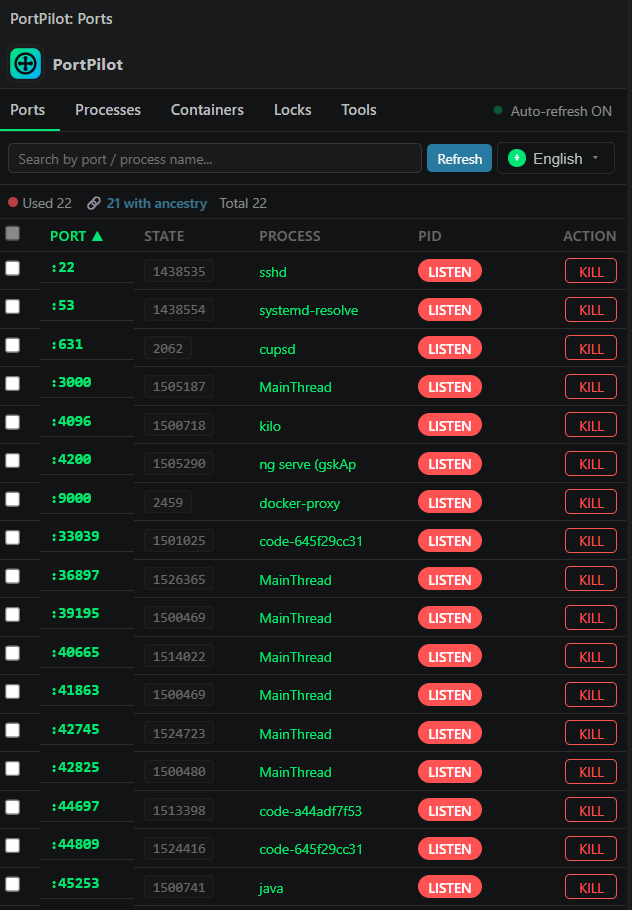

<div align="center">

# ⚡ PortPilot

### The fastest way to see, search, and kill anything hogging your local ports — right from VS Code.

[](https://marketplace.visualstudio.com/items?itemName=port-manager-saiki.portpilot)
[](https://marketplace.visualstudio.com/items?itemName=port-manager-saiki.portpilot)
[](LICENSE)
[](https://modelcontextprotocol.io)
[](#-supported-platforms)
[](#-multi-language-support)

</div>

---

<p align="center">
  
</p>

<p align="center">
  <strong>🔌  Search · 🔍  Find free ports · ☠️  Kill in one click · 📦  Bulk kill · 🌐  6 languages · 🤖  MCP server for AI agents</strong>
</p>

<div align="center">

> **"Where's that port 3000 coming from?"** — Stop alt-tabbing to the terminal. PortPilot lives in your Activity Bar so you can see every listening socket, find who's using it, and kill it — without leaving VS Code.

</div>

---

## ⭐ Smash that Star button — let's make some noise!

> This little extension runs on coffee, late nights, and **GitHub stars**. ☕
> Every star you give makes a stuck port magically free itself somewhere in the world. 🌍✨
> So go ahead — **[hit that ⭐ here](https://github.com/saisai-web/portpilot)** and help us hit the front page!

**🤝 Pull Requests are super welcome!**
Found a bug? Got a wild idea? [Open a PR](https://github.com/saisai-web/portpilot/pulls) — we don't bite. (The ports might, but we promise *we* don't.) 🔌

**👋 Let's connect & grow together!**
Always looking for new friends — I follow back! [Follow me on GitHub](https://github.com/saisai-web), drop a hello, and let's vibe. Mutual follows = mutual good vibes. 🚀

---

## ✨ Why PortPilot?

| 😩 The old way | ⚡ The PortPilot way |
|---|---|
| Open a terminal, run `lsof -i :3000`, copy the PID, then `kill -9 <pid>` | Click the port → click **KILL** |
| `ps aux \| grep` for the process holding port 8080 | Search by port number **or** process name |
| Kill 5 stuck dev servers one by one | Multi-select + **bulk kill** in one shot |
| Hop between 3 terminals to check if a range is free | **Range Scan** → instantly see how many ports are available |
| No way for your AI agent to inspect your ports | Ships as an **MCP server** — Claude Code, Kilo, Cursor, Continue, etc. |

**View listening ports, check availability, and kill processes — all inside VS Code.**

No more switching to a terminal to find out what's hogging port 3000. PortPilot gives you a dedicated sidebar panel and quick commands to manage your local ports without leaving your editor.


## Features

### 🔌 Sidebar Panel

A dedicated panel in the Activity Bar showing all listening ports in real time.

- **Search** — Filter by port number or process name instantly
- **Sort** — Click column headers to sort by port, process, PID, or state
- **Kill** — One-click kill with confirmation dialog
- **Bulk Kill** — Select multiple ports and kill them all at once
- **Range Scan** — Check how many ports are free in a given range

### ⌨️ Command Palette

Three commands accessible via `Ctrl+Shift+P` / `Cmd+Shift+P`:

| Command | Description |
|---------|-------------|
| **PortPilot: Show Listening Ports** | Quick Pick list → select a port to kill |
| **PortPilot: Check Port Availability** | Enter a port number → see if it's free or occupied |
| **PortPilot: Kill Port** | Enter port number(s) → kill immediately (comma-separated for bulk) |

### 🎨 Theme Support

Automatically adapts to your VS Code theme — dark, light, or high contrast.

### 🌐 Multi-language Support

UI is available in **6 languages**:

| Language | Code |
|----------|------|
| 🇺🇸 English | `en` |
| 🇪🇸 Español | `es` |
| 🇨🇳 Chinese | `zh` |
| 🇮🇳 हिन्दी | `hi` |
| 🇸🇦 العربية | `ar` (RTL) |
| 🇯🇵 日本語 | `ja` |

The extension automatically follows your VS Code display language. To override, run **PortPilot: Set Language** from the command palette, or set `portManager.language` in your settings.

## Supported Platforms

| Platform | Port Detection | Process Kill |
|----------|---------------|-------------|
| **macOS** | `lsof` | `kill -9` |
| **Linux** | `lsof` / `ss` | `kill -9` |
| **Windows** | `netstat` + `tasklist` | `taskkill /F` |

## Usage Tips

- **Can't kill a port?** On macOS/Linux, some system ports require `sudo`. On Windows, run VS Code as Administrator.
- **Port still showing after kill?** Hit the ↻ Refresh button — the OS may take a moment to release the port.
- **Use Range Scan** to quickly find an available port for your dev server.

## Requirements

- VS Code 1.101.0 or later (for MCP auto-discovery via `lm.registerMcpServerDefinitionProvider`)
- No additional dependencies for the extension itself; the MCP server brings `@modelcontextprotocol/sdk` automatically

## MCP Server (for AI clients)

PortPilot also ships as an [MCP](https://modelcontextprotocol.io) server, so any MCP-compatible client (Claude Code, Kilo, Cursor, Continue, etc.) can query and manage listening ports directly.

### Automatic setup on install

The extension auto-configures the MCP server so you don't have to edit any config file:

- **VS Code 1.101+** — when the extension activates it calls
  `vscode.lm.registerMcpServerDefinitionProvider` and VS Code auto-discovers
  the server and surfaces its tools in chat / agent mode. Declared via
  `contributes.mcpServerDefinitionProviders` in `package.json`.
- **`npm install` (development)** — the `postinstall` script:
  1. Downloads the WITR ancestry binary for your host into
     `resources/bin/` (if missing).
  2. Writes a `portpilot` entry into every well-known client config file
     it can find (`~/.config/Code/User/mcp.json`, `~/.config/kilo/mcp.json`,
     `~/.kilo/mcp.json`, `~/.claude.json`,
     `~/Library/Application Support/Claude/claude_desktop_config.json` on
     macOS, `%APPDATA%\Claude\claude_desktop_config.json` on Windows, etc.).
  All writes are **idempotent** — re-running never overwrites an existing
  entry.
- **Skip auto-config** any time with:
  ```bash
  PORTPILOT_SKIP_AUTOCONFIG=1 npm install
  # or
  npm install --ignore-scripts
  ```
  You can also disable the on-activation step from settings:
  `portManager.mcp.autoconfig: false`.

### Run it manually

```bash
npm run mcp          # stdio transport
# or after `npm link`:
portpilot-mcp
```

### Manual registration (if you skipped auto-config)

```jsonc
// kilo.json / .mcp.json / claude_desktop_config.json
{
  "mcpServers": {
    "portpilot": {
      "command": "node",
      "args": ["/absolute/path/to/port-manager/mcp-server/index.js"]
    }
  }
}
```

The auto-configured entry uses the same shape (absolute paths so it works
regardless of cwd). On Windows 11 the `.zip` extraction in
`scripts/postinstall.js` / `src/mcp/downloadWitr.js` relies on the built-in
`tar` (libarchive-backed since Windows 10 1803+) with a PowerShell
`Expand-Archive` fallback, so it works without any extra tooling.

### Tools exposed

| Tool | Purpose |
| --- | --- |
| `list_listening_ports` | List all TCP listening sockets (with optional WITR ancestry) |
| `check_port` | Is a given port free? |
| `find_ports_by_process` | Filter listening ports by process name |
| `get_port_info` | Detailed info for a single port (pid, process, ancestry) |
| `kill_port` | Graceful kill of the process owning a port (requires `confirm: true`) |
| `kill_pid` | Graceful kill by PID (requires `confirm: true`) |
| `witr_availability` | Whether the WITR binary is available on this host |

### Resources exposed

- `portpilot://manifest` — extension name, version, commands, configuration keys
- `portpilot://witr` — current WITR availability + resolved binary path

Destructive tools (`kill_port`, `kill_pid`) require an explicit `confirm: true` and will refuse otherwise. The server reuses the same `portService` and `witr` modules the VS Code sidebar uses, so behaviour stays in lock-step.

## Development

### Project Structure

```
src/
├── extension.js          # Entry point
├── core/
│   ├── constants.js      # Constants
│   └── portService.js    # Port detection & management
├── commands/
│   └── index.js          # VS Code commands
├── providers/
│   └── webviewProvider.js # Webview handler
├── i18n/
│   ├── index.js          # i18n API (detect, t, tr)
│   └── messages.js       # Translation dictionary (6 languages)
├── witr/                 # Bundled witr integration (host + runner)
└── webview/
    ├── index.js          # HTML generator
    ├── styles.js         # CSS
    └── script.js         # Client-side JS

package.nls.json          # Default NLS (English) — VS Code convention
package.nls.es.json       # Spanish NLS
package.nls.zh.json       # Chinese NLS
package.nls.hi.json       # Hindi NLS
package.nls.ar.json       # Arabic NLS
package.nls.ja.json       # Japanese NLS
```

> **Note**: `package.nls.*.json` files must live at the extension root — VS Code looks them up by hardcoded path (`package.json + .nls.{lang}.json`). Moving them to a subfolder breaks native localization of command titles, view names, and configuration descriptions.

### Publishing to VS Code Marketplace

#### 1. Prerequisites

```bash
npm install -g @vscode/vsce
```

#### 2. Create a Publisher (First time only)

1. Go to [Visual Studio Marketplace Publisher Management](https://marketplace.visualstudio.com/manage/publishers/)
2. Sign in with your Microsoft account
3. Click "Create publisher"
4. Enter Publisher ID and Display Name

#### 3. Create a Personal Access Token (PAT)

1. Go to [Azure DevOps](https://dev.azure.com/)
2. Click on your profile icon (top right) → "Personal access tokens"
3. Click "New Token"
4. Configure:
   - **Name**: Any name (e.g., "vsce-publish")
   - **Organization**: Select "All accessible organizations"
   - **Scopes**: Click "Custom defined" → Check "Marketplace" → "Manage"
5. Click "Create" and copy the token (save it securely)

#### 4. Login and Publish

PortPilot publishes **one VSIX per platform** (each bundles its own witr
binary). Use the bundled script to download witr and package all targets:

```bash
# Download witr binaries + build 6 per-platform VSIX
./PUBLISH.sh

# Build + publish in one step
VSCE_PAT=your_token_here ./PUBLISH.sh --publish "$VSCE_PAT"
```

The GitHub Actions workflow at `.github/workflows/release.yml` automates this
on every `v*` tag push — set the `VSCE_PAT` secret in your repo settings and
the marketplace update is fully hands-off.

#### 5. Update Version (for subsequent releases)

```bash
# Bump version and publish
vsce publish patch  # 1.0.0 -> 1.0.1
vsce publish minor  # 1.0.0 -> 1.1.0
vsce publish major  # 1.0.0 -> 2.0.0
```

### Notes

- The extension will be available on the Marketplace within a few minutes after publishing
- Make sure to update `CHANGELOG.md` before publishing new versions
- Never commit your PAT to the repository

## License

[MIT](LICENSE)

---

## 👤 About the Maintainer — [@cristopher-dev](https://github.com/cristopher-dev)

**Cristopher Martinez** — Senior developer with 5+ years of experience in education, IoT, legal apps, and banking security. Expert in innovation and automation. Based in Colombia 🇨🇴.

- 🌐 Website: [cristopher-dev.com](https://cristopher-dev.com/)
- 💼 LinkedIn: [in/cristopher-dev](https://www.linkedin.com/in/cristopher-dev)
- 👥 3 followers · 15 following · ⭐ 11 stars given
- 🏆 Achievement: Arctic Code Vault Contributor

### 📊 Profile Overview

| Metric | Value |
|---|---|
| Public repositories | **120** |
| Stars given | 11 |
| Projects | 0 |
| Packages | 0 |

> Source: [github.com/cristopher-dev?tab=repositories](https://github.com/cristopher-dev?tab=repositories) — synced Sep 1, 2026.
